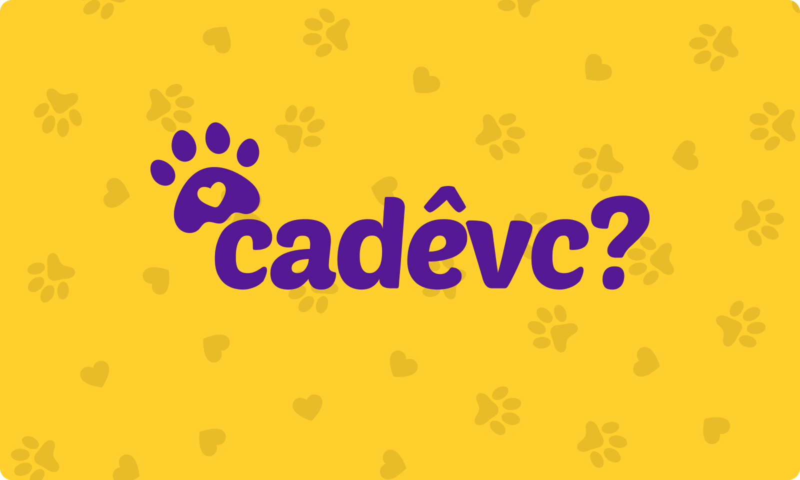

<p align="center">
  
</p>

<p align="center">  
  
</p>



<br>

# 🧪 Tecnologias

Esse projeto foi desenvolvido com as seguintes tecnologias:

- [React](https://reactjs.org)
- [TypeScript](https://www.typescriptlang.org/)
- [Radix Primitives](https://www.radix-ui.com/primitives)
- [Shadcn](https://ui.shadcn.com/)
- [TanStack React Query](https://tanstack.com/query/latest)
- [Axios](https://axios-http.com/ptbr/docs/intro)
- [Lucide React](https://lucide.dev/)
- [Tailwind CSS](https://tailwindcss.com/)
- [Zod](https://zod.dev/)
- [React Hook Form](https://react-hook-form.com/)
- [React Router Dom](https://reactrouter.com/en/main)
- [More](./package.json)

<br>

# 🚀 Como executar

Clone o projeto e acesse a pasta do mesmo.

Com https:
```bash
git clone https://github.com/scooby-doo-cade-voce/frontend.git cadevc-frontend
```

Com ssh:
```bash
git clone git@github.com:scooby-doo-cade-voce/frontend.git cadevc-frontend
```

Acesse a pasta do projeto
```bash
cd cadevc-frontend
```

Para iniciá-lo, siga os passos abaixo:

Instalar as dependências
```bash
pnpm install
```

Iniciar o projeto
```bash
pnpm dev
```
O app estará disponível no seu browser pelo endereço http://localhost:5173.

Lembrando que será necessário ter o [backend](https://github.com/scooby-doo-cade-voce/backend) rodando localmente para que o app funcione corretamente.

## Dicas
- Utilize o comando `pnpm lint` para corrigir os erros de lint
- Sempre verifique se seu commit foi efetuado com sucesso, utilizamos a ferramenta husky para que não deixe ser efetuado commits com erros de lint
- Sempre verifique se seu push foi efetuado com sucesso, utilizamos a ferramenta husky para que não deixe ser efetuado pushs com erros de lint e build

## 💻 Projeto

Devido à recente enchente no Rio Grande do Sul, muitos animais foram separados de seus donos. Em resposta a essa crise, desenvolvemos o projeto "Cadê Você?" com um propósito simples, porém vital: reunir animais perdidos com seus donos.

## 🔖 Layout

Você pode visualizar o layout do projeto através do link abaixo:

- [Layout Web](https://www.figma.com/design/yzQ2iQBZU7oLQVYT8uFQsC/%F0%9F%90%B6-Cad%C3%AA-Voc%C3%AA%3F?node-id=1103-1975&t=embXh78MeMxPGUAk-4) 

Lembrando que você precisa ter uma conta no [Figma](http://figma.com/).

## 📝 License

Esse projeto está sob a licença MIT. Veja o arquivo [LICENSE](LICENSE.md) para mais detalhes.

---

Feito com 💜 by Cadê Você 👋🏻 [Participe da nossa comunidade](https://discord.com/invite/Pr2BZmUG)